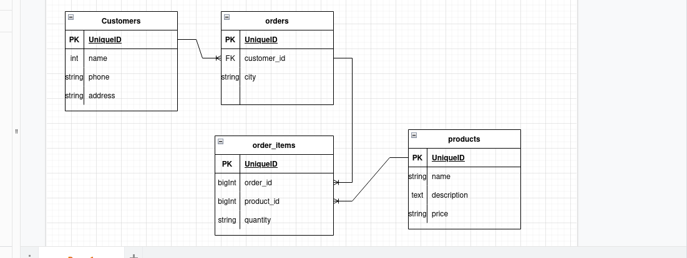

## Assignment Test

I have designed a database like the photo below .
##### Note 1 :  I put city in orders table so every order is related to a city .
##### Note 2 : I put postman collection with project files in the root directory .

##requirements
### PHP 8

## Download 
    1- git clone 
    2- cd [project name]
    3- composer install 
    4- edit .env to configure your database
    5- php artisan migrate: fresh --seed 
    6- php artisan serve

#Enjoy 🙂

## License
open-sourced software licensed under the [MIT license](https://opensource.org/licenses/MIT).
